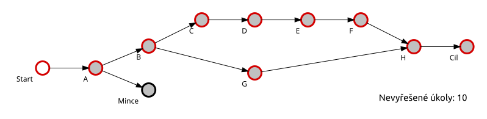
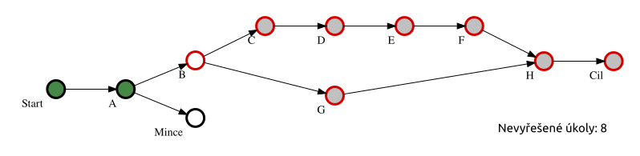
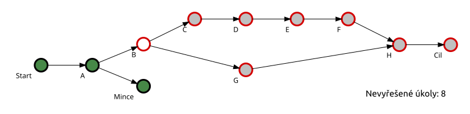
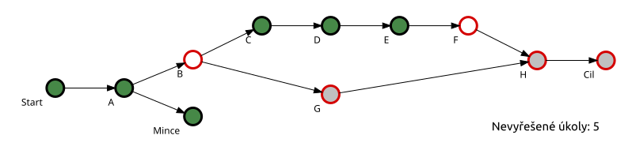
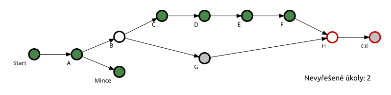
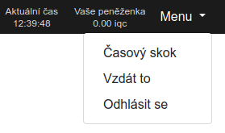
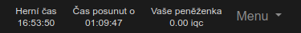

Způsob výpočtu pořadí
=====================

Základní kritérium podle kterého webové rozhraní počítá pořadí týmů je počet
dosud nevyřešených úkolů na cestě do cíle. Druhé kritérium je čas dosažení
posledního úkolu.

Určení počtu nevyřešených úkolů na cestě do cíle nemusí být v případě nelineární
soutěže na první pohled zcela zřejmé. Proto si jej názorně ukažme na
následujících obrázcích.

Červeně ohraničené úkoly se započítávají při určování výsledného pořadí.

----

Situace po splnění úkolu Start a úkolu A: dojde k otevření úkolu B a mincovního
úkolu. Počet nevyřešených úkolů se zmenší na 8.

----

Mincovní úkol není ve struktuře soutěže na cestě do cíle. Jeho splnění nijak
neovlivní počet úkolů započítávaných při určování pořadí a tedy ani samotné
pořadí v soutěži. Přináší to však jiné benefity :).

----

Situace kdy je úkol B splněn částečně, nedošlo ještě k otevření úkolu G.
Splněné úkoly C, D a E. Počet nevyřešených úkolů se tedy zmenší o 3.

----

Došlo k otevření úkolu H (a splnění F). Dodatečné splnění úkolu G již nevede
k faktickému přiblížení se k cíli, proto se od této chvíle již žádný úkol před H
již neuvažuje při výpočtu pořadí.

Funkce časový skok
==================

Abychom zabránili situacím kdy si nějaký soutěžní tým neví s obtížným úkolem
rady a nezbývá mu než pasivně čekat na vypršení deadlinu úkolu, který může být
relativně dlouhý,  zavedli jsme funkci "časový skok".

Po aktivaci této funkce dojde k posunu herního času pro daný soutěžní tým do
chvíle, kdy se má zobrazit nějaká nápověda, nebo vypršet nejbližší deadline
nějakého úkolu a zobrazit se řešení. Od této chvíle webové rozhraní přestane
zobrazovat aktuální čas a na místo něj se zobrazí herní čas a hodnota jeho
posunu oproti aktuálnímu času.

Ačkoli počet využití funkce časový skok není nijak omezen, její použití má vliv na
celkové pořadí v soutěži. Představme si efekt této funkce na příkladu:

V 9:00 hodin reálného času se soutěžní tým rozhodne že nechce čekat na deadline
úkolu který vyprší za 30 minut a využije funkci "časový skok". Herní čas se tak
týmu posune na 9:30, dojde k zobrazení řešení a o 10 minut později (9:10 hodin
reálného času, 9:40 herního času pro tento tým) tým dorazí na příslušný waypoint
a zadá soutěžní kód. Tento úspěch se však ve výsledném pořadí projeví až v 9:40
hodin reálného času, tak jako by soutěžní tým dosáhl waypoint až v 9:40.

Vedlejším efektem tohoto přístupu je to, že pokud vlivem opakovaného použití
funkce "časový skok" dojde k posunutí herního času až do doby po uplynutí konce
soutěže, tak soutěžní tým sice může v soutěži dál pokračovat a zkusit si řešit
úkoly až do skutečného konce soutěže, nicméně další vyřešené úkoly se již
nebudou započítávat do celkového pořadí.

